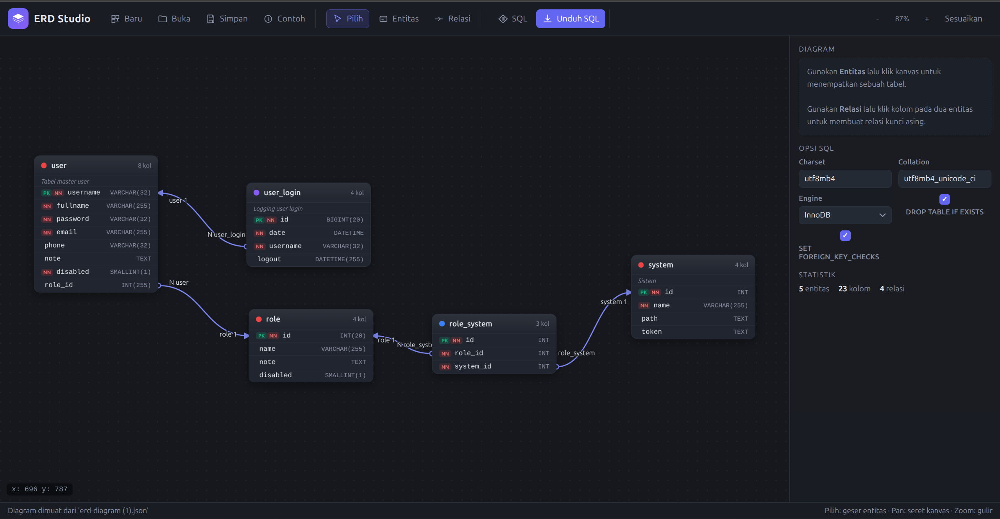

# ERD Studio

**ERD Studio - Desain Database MySQL** adalah aplikasi _web editor_ Entity Relationship Diagram (ERD) berbasis browser yang dirancang untuk merancang skema database MySQL secara visual. Semua data, penggambaran diagram, dan pembuatan script SQL diproses **sepenuhnya di peramban** (tanpa server), sehingga aplikasi ini ringan, cepat, dan aman untuk penggunaan offline.

Antarmuka menggunakan Bahasa Indonesia.

Demo online: [erd.swatizen.com](https://erd.swatizen.com)



## Fitur

- **Kanvas diagram interaktif** — buat entitas (tabel) dengan sekali klik, geser untuk memindahkan, seret kanvas untuk _pan_, dan gulir untuk _zoom_.
- **Editor kolom lengkap** — atur nama, tipe (27 tipe MySQL: `INT`, `BIGINT`, `VARCHAR`, `ENUM`, `JSON`, `UUID`, dll.), panjang/nilai enum, nilai default, komentar, serta properti:
  - `PK` (Primary Key) · `AI` (Auto Increment) · `Null` (Nullable) · `Uns` (Unsigned) · `Idx` (Index) · `UQ` (Unique)
- **Relasi antar tabel** — kardinalitas `1:N`, `1:1`, dan `N:N` (otomatis membuat tabel penghubung/junction `<sumber>_<tujuan>`), lengkap dengan `ON DELETE` dan `ON UPDATE` (`RESTRICT`, `CASCADE`, `SET NULL`, `NO ACTION`).
- **Pembuat script SQL (MySQL)** — otomatis menghasilkan:
  - `CREATE TABLE` untuk setiap entitas (dengan `PRIMARY KEY`, `UNIQUE`, `INDEX`).
  - `ALTER TABLE ... ADD CONSTRAINT ... FOREIGN KEY` untuk setiap relasi.
  - Opsi `charset` (`utf8mb4`), `collation`, dan `engine` (`InnoDB`).
  - Opsi `DROP TABLE IF EXISTS` dan `SET FOREIGN_KEY_CHECKS`.
  - Tombol **Salin** dan **Unduh .sql**.
- **Autosave** — perubahan tersimpan otomatis di `localStorage` peramban.
- **Ekspor / Impor JSON** — simpan diagram sebagai file `.json` dan buka kembali di perangkat/peramban lain.
- **Contoh diagram** berisi relasi lengkap yang dapat dimuat langsung untuk referensi.

## Instalasi

Tidak ada dependensi, tidak perlu `npm install`, dan tidak perlu proses _build_.

1. **Kloning atau salin berkas proyek ini** sehingga strukturnya seperti berikut:

   ```
   index.html
   style.css
   js/
     model.js
     renderer.js
     sql.js
     app.js
   ```

2. Buka dengan salah satu cara:

   - **Langsung (offline):** buka `index.html` di peramban (klik dua kali / double-click). Jalan dengan protokol `file://` tanpa konfigurasi apa pun.
   - **Lewat server lokal (opsional):**
     ```bash
     # Python 3
     python3 -m http.server 8000
     # lalu buka http://localhost:8000

     # atau dengan PHP
     php -S localhost:8000
     ```

3. Selesai — ERD Studio siap digunakan.

## Cara Penggunaan

### Membuat diagram

1. Klik tombol **Baru** di toolbar (atau buka halaman dengan hash `#new`).
2. Pilih alat **Entitas** (tombol `E` / angka `2`) lalu klik pada kanvas untuk menempatkan tabel.
3. Pilih alat **Pilih** (tombol `V` / angka `1`) lalu klik tabel untuk mengedit di panel kanan:
   - Ubah **Nama tabel**, **Warna**, dan **Komentar**.
   - Klik **+ Kolom** untuk menambah kolom; tentukan tipe, panjang, nilai default, komentar, dan properti `PK/AI/Null/Uns/Idx/UQ`.
   - Gunakan **▲/▼** untuk mengurutkan kolom dan **✕** untuk menghapusnya.

### Membuat relasi

1. Pilih alat **Relasi** (tombol `R` / angka `3`).
2. Klik kolom kunci pada tabel pertama, lalu klik kolom kunci pada tabel kedua (misal kolom `id` di satu tabel menuju kolom yang menjadi FK di tabel lain). Panel relasi akan terbuka.
3. Atur **Kardinalitas**, **ON DELETE**, **ON UPDATE**, dan nama relasi (opsional) lalu klik **Simpan Relasi**.

   - Untuk relasi `1:N`, panel menawarkan pembuatan kolom FK baru di sisi N.
   - Untuk `N:N`, aplikasi otomatis membuat tabel penghubung.

### Membuat SQL

1. Klik tombol **SQL** untuk pratinjau script `CREATE TABLE` + kunci asing.
2. Pilih opsi pratinjau di panel kanan: `Charset`, `Collation`, `Engine`, `DROP TABLE IF EXISTS`, dan `SET FOREIGN_KEY_CHECKS`.
3. Klik **Salin** untuk menyalin ke clipboard atau **Unduh .sql** untuk menyimpan ke berkas.

### Pintasan papan ketik

| Tombol      | Fungsi                               |
| ----------- | ------------------------------------ |
| `V` / `1`   | Alat Pilih                           |
| `E` / `2`   | Alat Entitas                         |
| `R` / `3`   | Alat Relasi                          |
| `Delete` / `Backspace` | Hapus entitas atau relasi terpilih |
| `Esc`       | Batalkan mode / tutup modal          |

### Klik kanan pada entitas

Menu konteks menyediakan: **Tambah kolom**, **Duplikat entitas**, dan **Hapus entitas**.

### Menyimpan & membuka

- **Autosave**: perubahan selalu tersimpan di `localStorage` peramban (kunci `erd-studio.diagram.v1`) dan dimuat otomatis saat dibuka.
- **Simpan**: unduh diagram sebagai berkas `.json`.
- **Buka**: muat diagram dari berkas `.json`.
- `#new` pada URL: memulai diagram kosong. `#sample`: memuat contoh diagram.

## Privasi & Data

Seluruh data diagram hanya disimpan di peramban Anda (`localStorage` dan berkas yang Anda unduh). Tidak ada data yang dikirim ke server eksternal.

## Struktur Berkas

| Berkas        | Peran                                                 |
| ------------- | ----------------------------------------------------- |
| `index.html`  | Struktur aplikasi, toolbar, panel, dan modal           |
| `style.css`   | Tema gelap, tata letak, dan responsif panel input      |
| `js/model.js` | Model data, autosave `localStorage`, serialisasi JSON  |
| `js/renderer.js` | Kanvas, entitas, pan/zoom, dan pengambilan relasi   |
| `js/sql.js`   | Generator script SQL (MySQL)                           |
| `js/app.js`   | Logika antarmuka, editor kolom/relasi, pintasan klavia |

## Kredit

Dibuat oleh **Emanuel Setio Dewo** dengan **Vibe Coding**.
